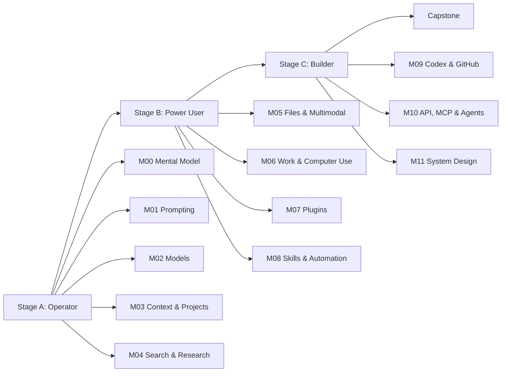

# ChatGPT Mastery Roadmap

Lộ trình học ChatGPT từ **người dùng hiệu quả** đến **power user** và **AI/agent builder**.

Khóa học vẫn được viết **song ngữ English–Tiếng Việt** để vừa học ChatGPT vừa xây khả năng đọc tài liệu AI bằng tiếng Anh. Tuy nhiên, **ngôn ngữ vận hành mặc định là tiếng Việt**: prompt, task brief, follow-up, ví dụ thực hành, verification prompt và bài ChatGPT exercise dùng tiếng Việt làm bản chính. Tiếng Anh được giữ ở phần thuật ngữ, `English reference` và English track.

> Xem quy tắc đầy đủ: [Vietnamese-first Usage](docs/VIETNAMESE-FIRST-USAGE.md)  
> Mục tiêu phát hành gần nhất: v0.2.0  
> Trạng thái hiện tại: preview — P2 complete, U05 pre-pilot complete, U06 beginner pilot pending  
> Source snapshot: 2026-09-10  
> Nguyên tắc: official-source-first, practice-first, verify-before-trust.

## Mức độ hoàn thiện hiện tại

Repo hiện có **11 bài READY**: 4 bài BOOT, 3 bài M00 và 4 bài M01. Các bài READY, assessment nền tảng và 3 guided Prompt Labs đã được chuẩn hóa theo **Vietnamese-first** để người học không phải tự dịch prompt sang tiếng Việt trước khi thực hành. M02–M11 vẫn được phát hành dần.

Người mới bắt đầu bằng [BOOT.1](modules/BOOT-getting-started/BOOT.1-first-chat.md), theo [START-HERE](START-HERE.md), và kiểm tra trạng thái trong [CONTENT-STATUS](docs/CONTENT-STATUS.md).

## Mục tiêu

Sau khi hoàn thành lộ trình, người học có thể:
1. Chọn đúng bề mặt làm việc: Chat, ChatGPT Work hoặc Codex.
2. Viết yêu cầu rõ theo Goal + Context + Output + Boundaries.
3. Chọn model/reasoning effort phù hợp.
4. Quản lý context bằng Projects, chats, files, personalization và memory.
5. Dùng Web Search và Deep Research có phương pháp, biết kiểm tra nguồn.
6. Làm việc với file, hình ảnh, voice và artifact có vòng review rõ.
7. Giao việc dài cho ChatGPT Work, Browser và Computer Use với quyền hạn hợp lý.
8. Kết nối dữ liệu/công cụ qua Plugins, hiểu permission và rủi ro.
9. Biến workflow lặp lại thành Skills và Scheduled Tasks.
10. Dùng Codex + GitHub cho công việc kỹ thuật.
11. Hiểu cầu nối từ ChatGPT sang API, MCP và Agents SDK.
12. Thiết kế workflow agentic thực tế, có kiểm thử và evaluation.

## Roadmap



## Ba chặng học

| Stage | Module | Kết quả |
|---|---|---|
| A — Operator | M00–M04 | Dùng ChatGPT đúng cách, prompt tốt, quản lý context, search/research đáng tin cậy |
| B — Power User | M05–M08 | Làm việc đa phương thức, giao việc dài, dùng plugins, skills và automation |
| C — Builder | M09–M11 | Codex/GitHub, API/MCP/Agents và thiết kế hệ thống agentic |
| Capstone | Project cuối khóa | Workflow hoàn chỉnh có nguồn dữ liệu, tool, review, automation và evaluation |

## Cách học

Mỗi lesson theo vòng:

**READ → EXPLAIN → PRACTICE → VERIFY → BUILD → REFLECT**

Không PASS chỉ vì đã đọc. Một lesson chỉ PASS khi bạn có thể giải thích, thực hiện task thật, chẩn đoán failure mode, kiểm kết quả và lưu evidence.

Chi tiết: [STUDY-METHOD.md](STUDY-METHOD.md)

### Học ChatGPT + English cùng lúc

Mọi lesson tuân theo:
- [Vietnamese-first Usage](docs/VIETNAMESE-FIRST-USAGE.md) — quy tắc ngôn ngữ vận hành;
- [Bilingual Lesson Standard](docs/BILINGUAL-LESSON-STANDARD.md) — chuẩn song ngữ;
- [LESSON-TEMPLATE.md](LESSON-TEMPLATE.md) — template biên soạn;
- [GLOSSARY.md](GLOSSARY.md) — từ vựng tích lũy.

**ChatGPT track:** có thể hoàn thành hoàn toàn bằng tiếng Việt.  
**English track:** học thuật ngữ, mẫu câu và đọc hiểu tài liệu chính thức.  
English exposure có thể tăng ở module sau, nhưng **không đảo prompt vận hành sang tiếng Anh làm mặc định**.

### Practice system / Hệ thống thực hành

Sau M01.4:
- [P-001 — Summary](labs/examples/P-001-summary.md)
- [P-002 — Planning](labs/examples/P-002-planning.md)
- [P-003 — Comparison](labs/examples/P-003-comparison.md)

Sau đó chấm bằng [Evaluation Lab](labs/EVALUATION-LAB.md) và checkpoint trong [assessments/](assessments/README.md). Dữ liệu lab là giả lập và có ground truth trong [labs/data/sample-brief.md](labs/data/sample-brief.md).

## Bắt đầu

1. Mở [START-HERE.md](START-HERE.md).
2. Đọc [CURRICULUM.md](CURRICULUM.md) để biết thứ tự.
3. Đọc [STUDY-METHOD.md](STUDY-METHOD.md) để hiểu vòng học và PASS.
4. Mở [PROGRESS.md](PROGRESS.md) để ghi năng lực.
5. Chỉ học lesson có `Content status = READY`.
6. Khi cần prompt tiếng Việt cho M00, dùng [M00 Vietnamese Prompt Pack](modules/M00-mental-model/M00-VI-PROMPT-PACK.md).

## Cấu trúc chính

```text
README.md
CURRICULUM.md
PROGRESS.md
STUDY-METHOD.md
LESSON-TEMPLATE.md
GLOSSARY.md
START-HERE.md
modules/
  BOOT-getting-started/
  M00-mental-model/
  M01-prompting/
  M02-models-reasoning/ ... M11-agentic-system-design/
assessments/
labs/
evidence/
docs/
capstone/
```

## Nguồn học
Nguồn chính là tài liệu chính thức của OpenAI, đặc biệt:
- ChatGPT Learn: https://learn.chatgpt.com/docs
- ChatGPT Use Cases: https://learn.chatgpt.com/use-cases
- OpenAI Help Center: https://help.openai.com/
- OpenAI Academy: https://academy.openai.com/
- OpenAI Developer Docs: https://developers.openai.com/

Xem [OFFICIAL-SOURCES.md](OFFICIAL-SOURCES.md).

## Quy tắc cập nhật

Trước khi viết/cập nhật lesson:
1. kiểm tài liệu chính thức hiện tại;
2. ghi source snapshot;
3. phân biệt nguyên lý bền vững với UI/tính năng có thể đổi;
4. không giữ hướng dẫn deprecated;
5. áp dụng Vietnamese-first cho mọi prompt/task brief/ví dụ thực hành;
6. QA phải xác nhận người mới hoàn thành ChatGPT track mà không cần tự dịch prompt từ tiếng Anh.
