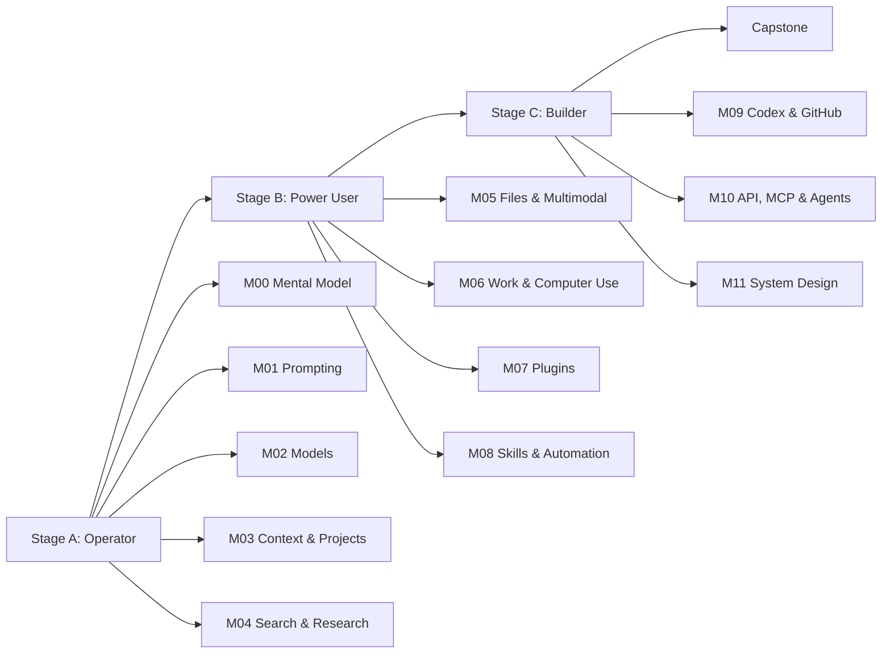

# ChatGPT Mastery Roadmap

Lộ trình học ChatGPT từ **người dùng hiệu quả** đến **power user** và **AI/agent builder**.

Khóa học được viết **song ngữ English–Tiếng Việt** để đồng thời xây năng lực sử dụng ChatGPT và khả năng đọc/viết tiếng Anh chuyên ngành AI. Thuật ngữ kỹ thuật giữ tên tiếng Anh chuẩn và luôn có giải thích tiếng Việt theo ngữ cảnh.

> Mục tiêu phát hành gần nhất: v0.2.0  
> Trạng thái hiện tại: preview — P2 content complete, P3 labs/pilot pending  
> Source snapshot: 2026-09-10  
> Nguyên tắc: official-source-first, practice-first, verify-before-trust.

## Mức độ hoàn thiện hiện tại

Repo hiện có **11 bài READY**: 4 bài BOOT, 3 bài M00 và 4 bài M01. Các lesson M02–M11 vẫn được phát hành dần. Người mới có thể bắt đầu bằng BOOT.1 và theo dõi trạng thái trong [CONTENT-STATUS](docs/CONTENT-STATUS.md).

Phạm vi nội dung P2 đã hoàn tất. Bước tiếp theo theo [kế hoạch cập nhật chi tiết](docs/UPDATE-PLAN.md) là **P3 — Labs, PASS, beginner pilot và gate phát hành v0.2.0**. Chưa coi preview hiện tại là bản đã xác nhận khả năng tự học qua pilot.

## Mục tiêu

Sau khi hoàn thành lộ trình, người học có thể:

1. Chọn đúng bề mặt làm việc: Chat, ChatGPT Work hoặc Codex.
2. Viết yêu cầu rõ ràng theo Goal + Context + Output + Boundaries.
3. Chọn model/reasoning effort phù hợp thay vì dùng một cấu hình cho mọi việc.
4. Quản lý context bằng Projects, chats, files, personalization và memory.
5. Dùng Web Search và Deep Research có phương pháp, biết kiểm tra nguồn.
6. Làm việc với file, hình ảnh, voice và các artifact có vòng review rõ ràng.
7. Giao việc dài cho ChatGPT Work, Browser và Computer Use với quyền hạn hợp lý.
8. Kết nối dữ liệu/công cụ qua Plugins, hiểu permission và rủi ro.
9. Biến workflow lặp lại thành Skills và Scheduled Tasks.
10. Dùng Codex + GitHub cho công việc kỹ thuật.
11. Hiểu cầu nối từ ChatGPT sang API, MCP và Agents SDK.
12. Thiết kế một workflow agentic thực tế, có kiểm thử và tiêu chí đánh giá.

## Roadmap



## Ba chặng học

| Stage | Module | Kết quả |
|---|---|---|
| A — Operator | M00–M04 | Dùng ChatGPT đúng cách, prompt tốt, quản lý context, search/research đáng tin cậy |
| B — Power User | M05–M08 | Làm việc đa phương thức, giao việc dài, dùng plugins, skills và automation |
| C — Builder | M09–M11 | Codex/GitHub, API/MCP/Agents và thiết kế hệ thống agentic |
| Capstone | Project cuối khóa | Workflow hoàn chỉnh có nguồn dữ liệu, tool, review, automation và evaluation |

## Cách học

Mỗi lesson theo vòng lặp:

**READ → EXPLAIN → PRACTICE → VERIFY → BUILD → REFLECT**

Không PASS chỉ vì đã đọc tài liệu. Một lesson chỉ PASS khi bạn có thể:

- giải thích khái niệm bằng lời của mình;
- thực hiện được một tác vụ thật;
- chỉ ra ít nhất một failure mode;
- biết cách kiểm tra kết quả;
- lưu evidence vào repo.

Chi tiết: [STUDY-METHOD.md](STUDY-METHOD.md)

### Học ChatGPT + English cùng lúc

Mọi lesson tuân theo [Bilingual Lesson Standard](docs/BILINGUAL-LESSON-STANDARD.md) và dùng [LESSON-TEMPLATE.md](LESSON-TEMPLATE.md). Từ vựng quan trọng được tích lũy trong [GLOSSARY.md](GLOSSARY.md). English exposure tăng dần từ Stage A đến Stage C nhưng tất cả bài vẫn giữ giải thích tiếng Việt.

## Bắt đầu

Mở [START-HERE.md](START-HERE.md) để chọn đường học, kiểm tra bài READY, lưu evidence và xử lý khi thiếu tính năng. Xem [CONTENT-STATUS.md](docs/CONTENT-STATUS.md) trước khi bắt đầu từng lesson.

1. Đọc [CURRICULUM.md](CURRICULUM.md) để biết thứ tự.
2. Đọc [STUDY-METHOD.md](STUDY-METHOD.md) để biết vòng học và PASS.
3. Mở [PROGRESS.md](PROGRESS.md) để ghi năng lực của bạn.
4. Chỉ học lesson có `Content status = READY`; các lesson khác mới là đề cương/kế hoạch.
5. Cập nhật PROGRESS từ lúc bắt đầu; chỉ chuyển trạng thái sang PASS khi evidence của bạn đạt tiêu chí.

## Cấu trúc repo

```text
chatgpt-mastery-roadmap/
├── README.md
├── CURRICULUM.md
├── PROGRESS.md
├── STUDY-METHOD.md
├── LESSON-TEMPLATE.md
├── GLOSSARY.md
├── OFFICIAL-SOURCES.md
├── CHANGELOG.md
├── START-HERE.md
├── modules/
│   ├── M00-mental-model/
│   ├── M01-prompting/
│   ├── M02-models-reasoning/
│   ├── M03-context-projects-memory/
│   ├── M04-search-research/
│   ├── M05-files-multimodal/
│   ├── M06-work-browser-computer/
│   ├── M07-plugins-connected-data/
│   ├── M08-skills-automation/
│   ├── M09-codex-github/
│   ├── M10-api-mcp-agents/
│   └── M11-agentic-system-design/
├── assessments/
│   ├── BOOT-CHECK.md
│   ├── M00-CHECK.md
│   └── M01-CHECK.md
├── evidence/
│   ├── README.md
│   └── TEMPLATE.md
├── labs/
│   ├── PROMPT-LAB.md
│   ├── EVALUATION-LAB.md
│   └── examples/
├── capstone/
│   └── README.md
└── docs/
    ├── ROADMAP-DESIGN.md
    ├── BILINGUAL-LESSON-STANDARD.md
    ├── LEARNING-PATHS.md
    ├── CONTENT-STATUS.md
    ├── FEATURE-AVAILABILITY.md
    ├── TROUBLESHOOTING.md
    └── UPDATE-PLAN.md
```

## Nguồn học

Nguồn chính là tài liệu chính thức của OpenAI, đặc biệt:

- ChatGPT Learn: https://learn.chatgpt.com/docs
- ChatGPT Use Cases: https://learn.chatgpt.com/use-cases
- OpenAI Help Center: https://help.openai.com/
- OpenAI Academy: https://academy.openai.com/
- OpenAI Developer Docs: https://developers.openai.com/

Xem danh sách được tuyển chọn tại [OFFICIAL-SOURCES.md](OFFICIAL-SOURCES.md).

## Quy tắc cập nhật

ChatGPT thay đổi nhanh. Trước khi viết hoặc cập nhật một lesson:

1. kiểm tra tài liệu chính thức hiện tại;
2. ghi ngày source snapshot;
3. phân biệt nguyên lý bền vững với UI/tính năng có thể đổi;
4. không giữ hướng dẫn đã deprecated chỉ vì từng đúng trước đây.
